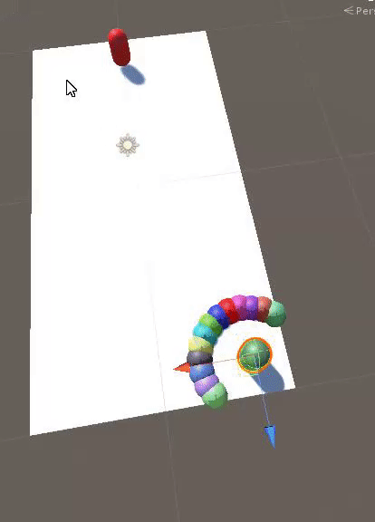

# Formations
Example implementation of units moving in formation. Without NavMesh or collider.

### Attack Formation
---

The units will try to surround the enemy.
If the enemy is close to a wall, the will occupy the available arc.

### Defend Formation

## Controls
Left click - Defend, behind the player.

Right click - Attack, surround the target.

WASD - Movement

QE - Rotation.
